<div align="center">


<br/>


<br/>

<a href="https://sharad-bhaisaniya-sharad-porfolio-n.vercel.app/">

</a>

<a href="https://www.linkedin.com/in/sharad-bhaisaniya">

</a>

<a href="mailto:bhavishybhaisaniya1432@gmail.com">

</a>

<a href="https://wa.me/91XXXXXXXXXX">

</a>

<br/><br/>


</div>

---

# ✦ ABOUT ME

<table>
<tr>
<td width="58%">

```js
const sharad = {
    role: "Full-stack Developer",
    location: "Indore, India",
    experience: "1+ Years",
    techStack: [
        "Laravel",
        "React.js",
        "Node.js",
        "MongoDB",
        "MySQL",
        "Tailwind CSS"
    ],
    expertise: [
        "Fintech Platforms",
        "ERP Systems",
        "Modern Dashboards",
        "REST APIs",
        "Scalable Applications"
    ],
    currentFocus: "Building modern web experiences"
};
```

### ✦ Professional Summary

I’m a passionate **Full-stack Developer** specializing in:

- ⚡ Laravel Backend Architecture  
- ⚡ MERN Stack Applications  
- ⚡ Modern Dashboard Interfaces  
- ⚡ Scalable API Development  
- ⚡ Premium UI/UX Experiences  

I build high-performance applications with clean architecture,
modern aesthetics, and production-ready scalability.

</td>

<td width="42%">

<div align="center">


<br/>


</div>

</td>
</tr>
</table>

---
# ✦ TECH ARCHITECTURE

```mermaid
graph TB

%% CORE
A[⚡ SHARAD BHAISANIYA]

%% FRONTEND
A --> B[🎨 Frontend]

B --> B1[React.js]
B --> B2[Next.js]
B --> B3[Tailwind CSS]
B --> B4[JavaScript]
B --> B5[TypeScript]

%% BACKEND
A --> C[⚙️ Backend]

C --> C1[Laravel]
C --> C2[Node.js]
C --> C3[Express.js]
C --> C4[PHP]

%% DATABASE
A --> D[🗄️ Database]

D --> D1[MongoDB]
D --> D2[MySQL]

%% TOOLS
A --> E[🛠️ Tools]

E --> E1[Git]
E --> E2[GitHub]
E --> E3[VS Code]
E --> E4[Figma]

%% STYLING
style A fill:#06b6d4,color:#fff,stroke:#0f172a,stroke-width:4px

style B fill:#111827,color:#06b6d4,stroke:#06b6d4
style C fill:#111827,color:#06b6d4,stroke:#06b6d4
style D fill:#111827,color:#06b6d4,stroke:#06b6d4
style E fill:#111827,color:#06b6d4,stroke:#06b6d4

style B1 fill:#1e293b,color:#fff
style B2 fill:#1e293b,color:#fff
style B3 fill:#1e293b,color:#fff
style B4 fill:#1e293b,color:#fff
style B5 fill:#1e293b,color:#fff

style C1 fill:#1e293b,color:#fff
style C2 fill:#1e293b,color:#fff
style C3 fill:#1e293b,color:#fff
style C4 fill:#1e293b,color:#fff

style D1 fill:#1e293b,color:#fff
style D2 fill:#1e293b,color:#fff

style E1 fill:#1e293b,color:#fff
style E2 fill:#1e293b,color:#fff
style E3 fill:#1e293b,color:#fff
style E4 fill:#1e293b,color:#fff
```

<div align="center">



</div>


# ✦ TECH STACK

<div align="center">


</div>

<br/>

# ✦ TECH EXPERTISE

<div align="center">

<table width="100%">
<tr>

<td width="25%">

<h3 align="center">🎨 Frontend</h3>

```css
React.js        ████████████████ 95%
Next.js         ██████████████░░ 88%
Tailwind CSS    ███████████████ 92%
JavaScript      ███████████████ 90%
TypeScript      ████████████░░░ 80%
```

</td>

<td width="25%">

<h3 align="center">⚙️ Backend</h3>

```css
Laravel         ████████████████ 96%
Node.js         █████████████░░░ 85%
Express.js      ████████████░░░░ 78%
PHP             ██████████████░░ 89%
REST APIs       ███████████████░ 91%
```

</td>

<td width="25%">

<h3 align="center">🗄️ Database</h3>

```css
MongoDB         █████████████░░░ 84%
MySQL           ██████████████░░ 88%
Firebase        ███████████░░░░░ 72%
PostgreSQL      ██████████░░░░░░ 68%
Redis           █████████░░░░░░░ 60%
```

</td>

<td width="25%">

<h3 align="center">🛠️ Tools</h3>

```css
Git             ███████████████░ 90%
GitHub          ███████████████░ 92%
VS Code         ████████████████ 96%
Figma           █████████████░░░ 83%
Linux           ███████████░░░░░ 74%
```

</td>

</tr>
</table>

</div>

---

# ✦ DEVELOPMENT MATRIX

<div align="center">

```css
Frontend Engineering     ████████████████████ 95%
Backend Architecture     ██████████████████░ 92%
Database Management      ████████████████░░░ 84%
UI/UX Design             █████████████████░░ 88%
API Integration          ██████████████████░ 91%
System Optimization      ███████████████░░░░ 80%
```

</div>

---

# ✦ DEVELOPMENT EXPERTISE

<div align="center">


<br/><br/>


</div>

---

# ✦ FEATURED PROJECTS

<div align="center">

<table>
<tr>

<td width="50%">

## 🚀 Bharat Stock Market Platform


### Features

✔ Digio KYC Verification  
✔ Razorpay Payment Gateway  
✔ Secure Authentication  
✔ Admin Dashboard  
✔ Real-time Analytics  

</td>

<td width="50%">

## 💎 Jewellery ERP System


### Features

✔ Barcode Scanning  
✔ GST Billing System  
✔ Inventory Management  
✔ Invoice Automation  
✔ Analytics Dashboard  

</td>

</tr>
</table>

</div>

---

# ✦ GITHUB ANALYTICS

<div align="center">


<br/><br/>


</div>

---

# ✦ ACHIEVEMENTS

<div align="center">


</div>

---

# ✦ CONTRIBUTION GRAPH

<div align="center">


</div>

<br/>


---

# ✦ CURRENT FOCUS

<div align="center">

| 🚀 Currently Working On | ⚡ Learning |
|-------------------------|-------------|
| Advanced Laravel Systems | AI Integrations |
| SaaS Dashboard Projects | System Design |
| MERN Stack Platforms | Cloud Deployment |
| Modern UI Components | Performance Optimization |

</div>

---

# ✦ CONNECT WITH ME

<div align="center">

<a href="https://www.linkedin.com/in/sharad-bhaisaniya">

</a>

<a href="mailto:bhavishybhaisaniya1432@gmail.com">

</a>

<a href="https://sharad-bhaisaniya-sharad-porfolio-n.vercel.app/">

</a>

</div>

<br/>

<div align="center">


### ⚡ Building scalable digital experiences with Laravel & MERN ⚡

</div>
